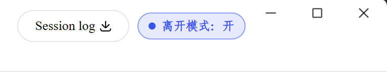
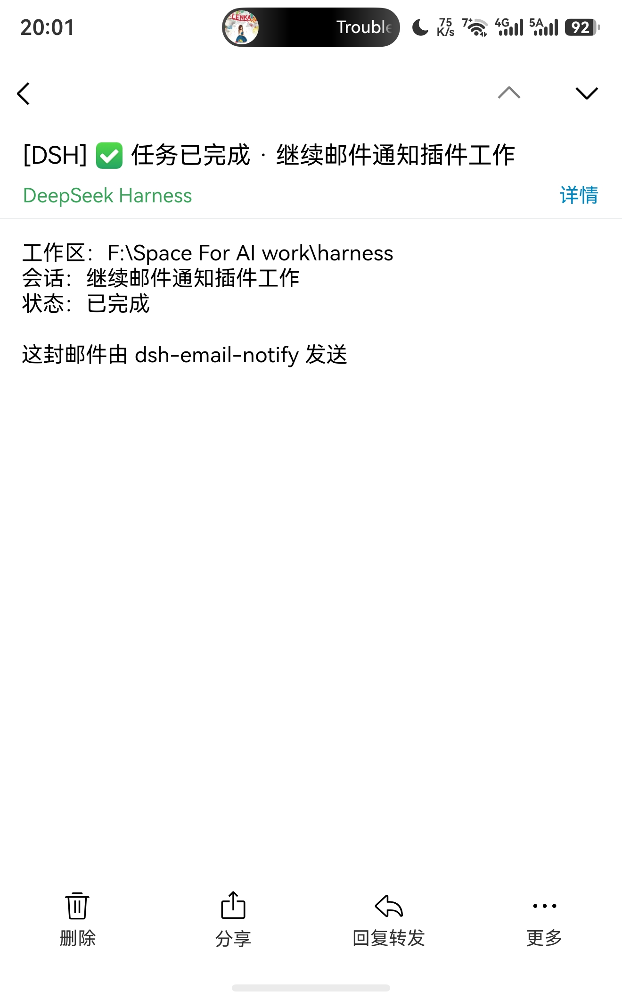
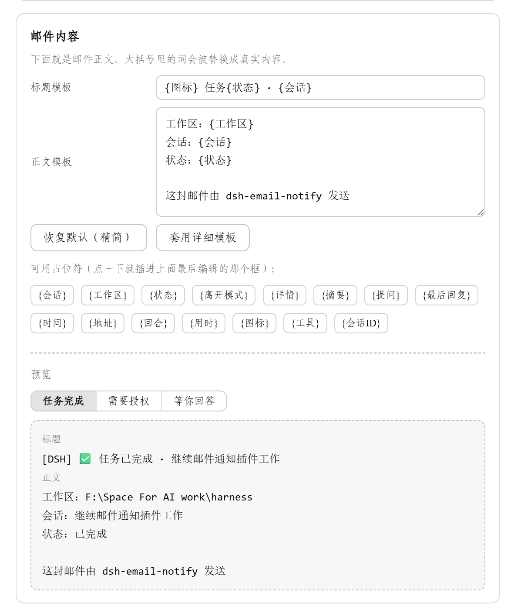
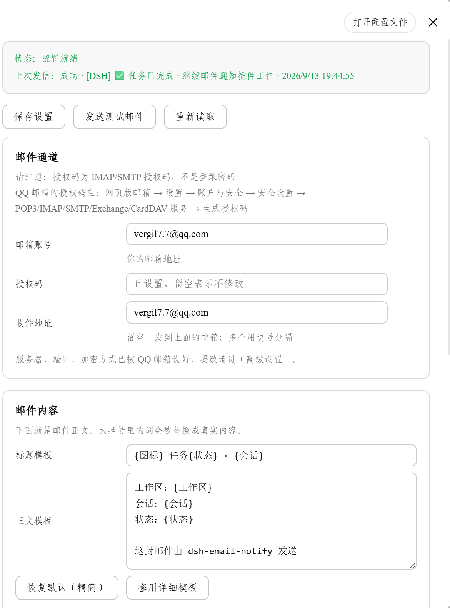

# dsh-email-notify

[简体中文](README.md) · **English**

[](CHANGELOG.md)
[](LICENSE)

[](https://github.com/topics/dsh-plugin)

An email notification plugin for [DeepSeek Harness](https://github.com/topics/dsh-plugin) (DSH): when you step away from your machine, DSH emails you.

- **Turn finished** — including errors and aborted turns
- **A tool needs your approval** — the task is parked, waiting for you to click *Allow*
- **The assistant asks you a question** — the email includes the question and its options

Whether mail goes out at all is decided by the **Away Mode** button in the session header: tap it before you leave, tap it again when you're back.
Zero dependencies, sends directly from your machine over SMTP (QQ Mail / 163 / Gmail / Outlook / self-hosted).
All settings live in the DSH settings panel — no CLI flags, no hand-edited JSON.

<p align="center">
  
</p>
<p align="center">
  
</p>

## Install

```bash
dsh plugin --profile web add github:Vergil-long/dsh-email-notify
```

Then:

1. Restart the DSH desktop app (quitting it restarts the backend too)
2. Open **Settings → Email Notifications**, fill in your address and credential. QQ Mail is preconfigured — just enable "IMAP/SMTP service" on the webmail and generate a 16-digit authorization code (not your login password)
3. Turn on **Away Mode** in the session header — it ships **off** since 0.4.0, and nothing is mailed until you enable it

On Windows you can also double-click `安装邮件通知.cmd` from the repo. To install from a local checkout:
`dsh plugin --profile web add link:/absolute/path/dsh-email-notify` (keep the path free of spaces, or pnpm
fails with `ERR_PNPM_SPEC_NOT_SUPPORTED`). Uninstall: `node scripts/install.mjs --uninstall`.

To upgrade: `node scripts/update-all.mjs` — syncs the plugin code and re-applies the desktop-shell false-notification patch in one go.

## Away Mode

The button at the right end of the session header is the master switch:

| Button | Behavior |
| --- | --- |
| `Away: on` | Every notification you enabled is mailed, whether or not you're watching the UI |
| `Away: off` (default) | Nothing is mailed, ever |
| `Away: auto` (button dimmed) | "Auto mode" is on in advanced settings: old behavior, mail only when you're judged away |

Why not let the plugin guess: the only signal it has is window focus, and "the person left but the window is still open — even focused" is the most common case of all. Auto-detection then assumes you're watching, and you get nothing on your phone. So the decision stays with you. The state persists across restarts.

## What the email looks like

Subject and body are editable templates with 15 placeholders (`{session}`, `{status}`, `{summary}`, `{duration}`, …), with a live preview in the settings panel. The default body is short on purpose — something you can glance at on a phone:

```
Workspace: F:\Space For AI work\harness
Session: dsh-email-notify
Status: completed
Away mode: on

Sent by dsh-email-notify
```

"Awaiting your answer" mails expand to include the question and options; the task stays paused until you answer in the DSH window.

<p align="center"></p>

## Settings

The basic page has just two boxes: account and credential. SMTP server, notification timing, rate limits and auto mode all live behind the "Advanced ▸" sub-page and work out of the box. Config is stored in `~/.dsh/dsh-email-notify/config.json`; the credential never leaves your machine and is never echoed back to the UI.

<p align="center"></p>

Full field reference, the complete placeholder table, and the environment-variable option: [docs/配置参考.md](docs/配置参考.md) (Chinese)

## FAQ

| Symptom | Why |
| --- | --- |
| No mail at all after installing | Away Mode ships off. Turn it on in the session header |
| `535` error | QQ Mail needs the 16-digit authorization code, not your login password |
| Log says "config incomplete, skipping" | Something is still empty; the panel header lists what's missing |
| Subject has no task name | Since 0.3.0 the sidebar session name is used; "(unnamed session)" means the title hadn't been generated yet |
| Literal `{session}` in the mail | The host half is outdated. Run `node scripts/verify-live.mjs`, then sync and restart |
| Anything else | See [docs/测试与排查.md](docs/测试与排查.md) (Chinese) |

## Docs

- [配置参考](docs/配置参考.md) — settings reference, full placeholder table, config.json, env vars (Chinese)
- [设计与架构](docs/设计与架构.md) — why the shell's DOM-based notifications aren't trusted, code layout, host HTTP API, design trade-offs (Chinese)
- [测试与排查](docs/测试与排查.md) — how to run the 8 test suites, live verification, full troubleshooting table (Chinese)
- [Shell false-notification patch](shell-patch/README.md) — standalone one-command fix for the desktop shell
- [Changelog](CHANGELOG.md)

## License

[MIT](LICENSE). Built as a human–AI pair: requirements and trade-offs decided by Vergil-long; code, tests and docs written by DeepSeek Harness.
